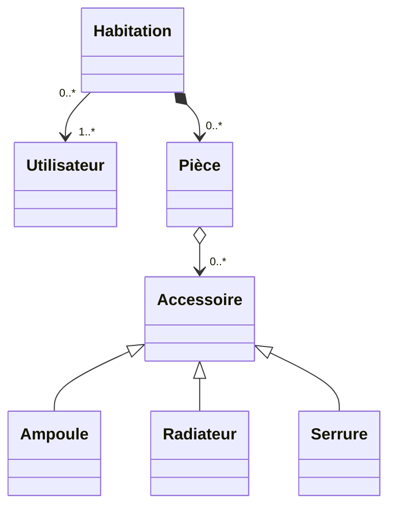
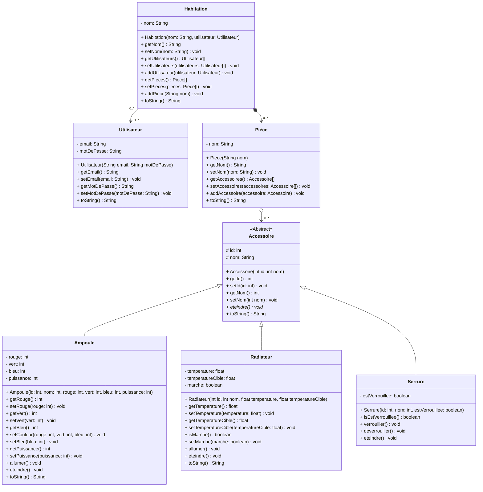

# Interrogation
## Diagramme de classes - Implémentation

### Contenu
Diagramme de Classe (UML), Association, Agrégation, Composition, Héritage, Implémentation de Classes (constructeurs, getters/setters, surcharges de méthodes (toString...)), Encapsulation, Classes Abstraites, Polymorphisme (tableaux/listes de classes héritées).

### Cahier des charges

Nous souhaitons réaliser une application de gestion d’accessoires connectés (ampoules, radiateurs, serrures). Pour cela, notre application devra permettre la gestion de plusieurs habitations. Une habitation est représentée par un nom et d’une liste d’utilisateurs autorisés à accéder aux accessoires de celle-ci. Un utilisateur dispose d’une adresse e-mail et d’un mot de passe. Chaque habitation possède une ou plusieurs pièces (ayant un nom, par exemple : « Salon »), dans lesquelles peuvent se trouver des accessoires connectés. Chaque accessoire a un nom (« Lampe de chevet droite ») et un identifiant (entier), et met à disposition une fonctionnalité : « éteindre ». Il existe différents types d’accessoires :
-	**Ampoules :** elles possèdent un taux de rouge, de vert et de bleu (RGB : chacun compris entre 0 et 255), et une puissance (0 = éteint, 100 = luminosité maximale). Il est possible de les allumer (à une puissance par défaut de 65%), de les éteindre (puissance 0%), de régler leur couleur (RGB) et leur puissance (en pourcentage).
-	**Radiateurs :** ils possèdent comme informations : la température de la pièce, une température cible, et un état en marche / arrêté. Il est possible de les allumer et les éteindre (simple changement d’état), de changer la température cible. Nous ne gérerons ni la chauffe, ni la température de la pièce dans cette évaluation.
-	**Serrures :** elles possèdent un état verrouillé / déverrouillé. Eteindre une serrure revient à la verrouiller. Deux actions supplémentaires sont possibles pour les serrures : verrouiller et déverrouiller.

Nous ne gérerons que les ajouts, pas les suppressions, et dans le cas d’utilisation de tableaux (à la place d’ArrayLists), nous considérerons qu’ils ont une taille physique suffisante pour l’ajout.
Par exemple, on pourra ajouter un accessoire (ampoule / radiateur / serrure) à une pièce.

### Exercice 1.1 – Diagramme de classes (sans attribut ni méthode)

Donnez un diagramme de classes répondant au cahier des charges précédent. Vous ne donnerez ici ni les attributs des classes ni leurs méthodes, qui seront à préciser sur la page suivante.



### Suite exercice 1.2 – Diagramme de Classes, sans relations

Réécrivez les classes de l’exercice 1.1, sans les relations, mais en rajoutant cette fois-ci les attributs et les méthodes de chaque classe.

```mermaid
classDiagram
    class Habitation {
        - nom: String
        + Habitation(nom: String, utilisateur: Utilisateur)
        + getNom() String
        + setNom(nom: String) void
        + getUtilisateurs() Utilisateur[]
        + setUtilisateurs(utilisateurs: Utilisateur[]) void
        + addUtilisateur(utilisateur: Utilisateur) void
        + getPieces() Piece[]
        + setPieces(pieces: Piece[]) void
        + addPiece(String nom) void
        + toString() String
    }
    
    class Utilisateur {
        - email: String
        - motDePasse: String
        + Utilisateur(String email, String motDePasse)
        + getEmail() String
        + setEmail(email: String) void
        + getMotDePasse() String
        + setMotDePasse(motDePasse: String) void
        + toString() String
    }
    
    class Pièce {
        - nom: String
        + Piece(String nom)
        + getNom() String
        + setNom(nom: String) void
        + getAccessoires() Accessoire[]
        + setAccessoires(accessoires: Accessoire[]) void
        + addAccessoire(accessoire: Accessoire) void
        + toString() String
    }
    
    class Accessoire {
        <<Abstract>>
        # id: int
        # nom: String
        + Accessoire(int id, int nom)
        + getId() int
        + setId(id: int) void
        + getNom() int
        + setNom(int nom) void
        + eteindre() void*
        + toString() String
    }

     class Ampoule {
        - rouge: int
        - vert: int
        - bleu: int
        - puissance: int
        + Ampoule(id: int, nom: int, rouge: int, vert: int, bleu: int, puissance: int)
        + getRouge() int
        + setRouge(rouge: int) void
        + getVert() int
        + setVert(vert: int) void
        + getBleu() int
        + setCouleur(rouge: int, vert: int, bleu: int) void
        + setBleu(bleu: int) void
        + getPuissance() int
        + setPuissance(puissance: int) void
        + allumer() void
        + eteindre() void
        + toString() String
     }

     class Radiateur {
        - temperature: float
        - temperatureCible: float
        - marche: boolean
        + Radiateur(int id, int nom, float temperature, float temperatureCible)
        + getTemperature() float
        + setTemperature(temperature: float) void
        + getTemperatureCible() float
        + setTemperatureCible(temperatureCible: float) void
        + isMarche() boolean
        + setMarche(marche: boolean) void
        + allumer() void
        + eteindre() void
        + toString() String
     }

     class Serrure {
        - estVerrouillee: boolean
        + Serrure(id: int, nom: int, estVerrouillee: boolean)
        + isEstVerrouillee() boolean
        + verrouiller() void
        + deverrouiller() void
        + eteindre() void
     }
```



### Diagramme de classes complet



### Exercice 2 – Implémentation en Java

Implémentez en Java votre diagramme de classes de l’exercice 1.1 et 1.2.

```
Voir classes Java.
```