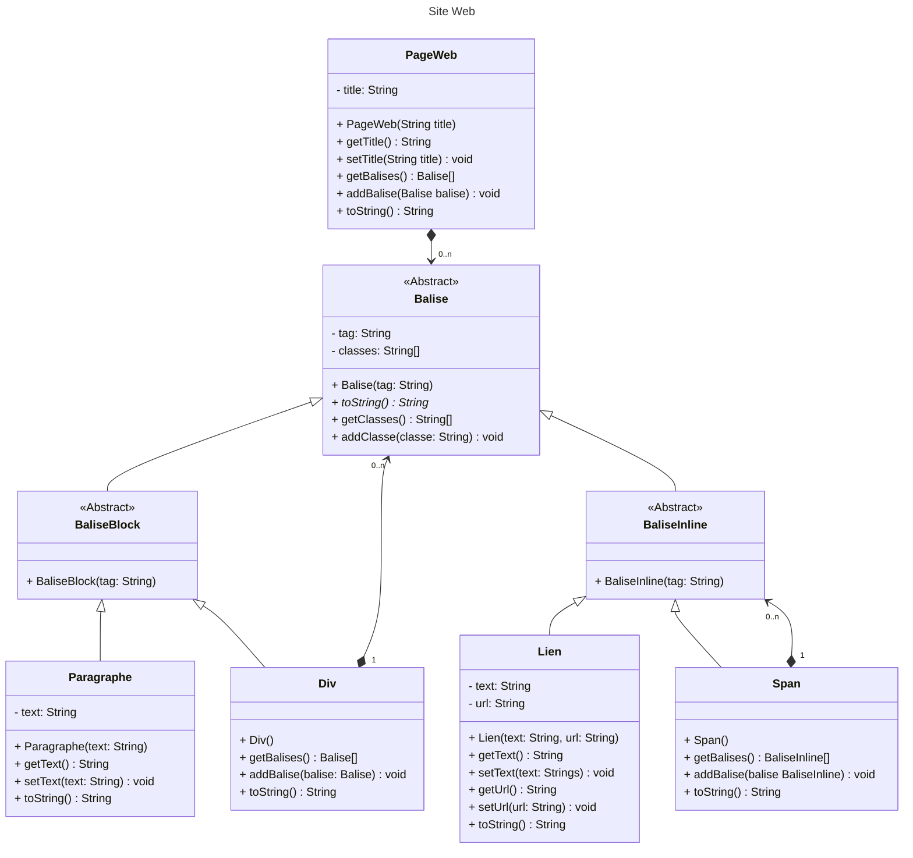

# Interrogation (rattrapage)
## Diagramme de classes - Implémentation

### Cahier des charges

Nous souhaitons réaliser une application de génération de pages Web en HTML. Chaque page web comportera un titre (balise `<title>Titre</title>`) personnalisable, ainsi que des balises. Chaque balise peut être soit une balise de type block, soit inline. Nous ne créerons que trois balises dans cette interrogation : les paragraphes (`<p>texte</p>`), les conteneurs block (`<div>balises</div>`) et les liens (`<a href="url">texte</a>`). Nos paragraphes ne contiendront que du texte (pas de sous-balises), les conteneurs blocks ne contiendront que des sous-balises (block ou inline), les liens ne contiendront que du texte et disposeront d’un attribut spécifique (`href`) contenant l'URL. Toutes les balises pourront contenir plusieurs classes CSS (`<x class="maClasse1 maClasse2">…</x>` où `x` est le « tag » de la balise : `p` pour les paragraphes, `div` pour les conteneurs block, `a` pour les liens, etc. Chaque balise a donc un tag, dépendant de la balise). Il n’est possible d’ajouter des balises que dans la page web, et dans les conteneurs block uniquement.
En affichant une page web avec `System.out.println()`, nous devrons voir dans le terminal un code HTML approximatif :

```
<!doctype html><html><head><title>ECE - Ecole d'ingénieurs</title></head><body>[<p
class="[]">Ceci est un paragraphe.</p>, <p class="[maClasse]">Ceci est un deuxième paragraphe.</p>, <div class="[]">[<a href="https://www.ece.fr" class="[c1, c2]">ECE</a>, <p class="[]">Paragraphe</p>]</div>]</body></html>
```



**Bonus** : La classe `Span` qui est un conteneur ne pouvant contenir que des balises inline.