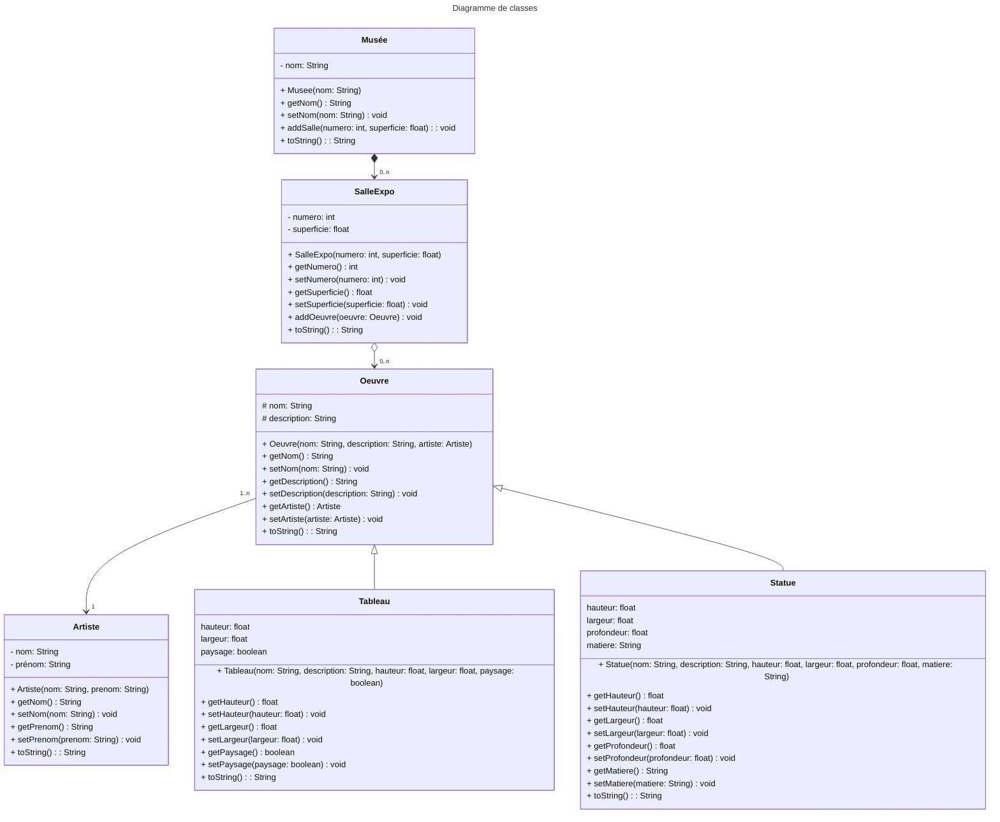

# Cahier des charges (CDC)

Un organisme culturel souhaite que nous réalisions pour elle une application en Java,
afin de gérer les œuvres de ses musées. 
Chaque musée dispose d'un nom et de plusieurs salles d'exposition. 
Chaque salle d'exposition, d'un numéro et d'une superficie donnée, 
contient des œuvres ayant chacune un nom, une description et un artiste.
Un artiste est représenté par un nom et un prénom.
L'organisme ne gère que deux types d'œuvres :
des tableaux, ayant une hauteur, une largeur et un statut portrait/paysage,
et des statues ayant une hauteur, une largeur, une profondeur et une matière.

## Diagramme de classes 

**NB :** On aurait pu mettre `largeur` et `hauteur` directement dans la classe `Oeuvre` car ce sont des attributs communs aux deux types d'oeuvres.
Cependant, en faisant comme ça, on pourra créer d'autres types d'oeuvres qui n'ont pas de `largeur` ou pas de `hauteur`.