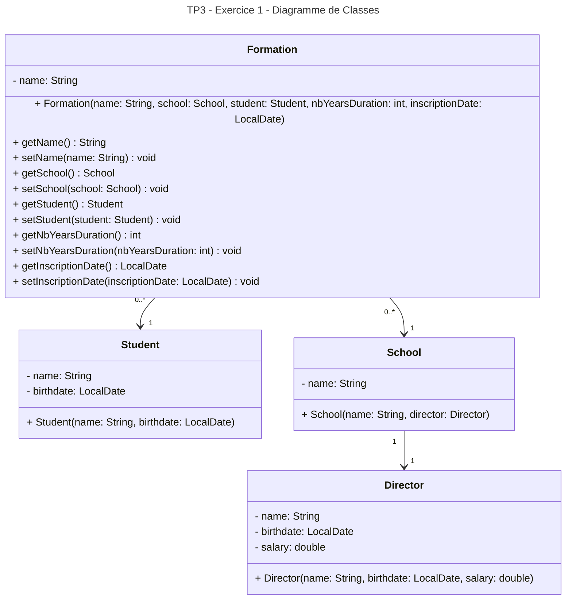

# TP3
## Exercice 1
### Diagramme de Classes

```mermaid
---
title: TP3 - Exercice 1 - Diagramme de Classes
---
classDiagram
    
    class Director {
        - name: String
        - birthdate: LocalDate
        - salary: double
        + Director(name: String, birthdate: LocalDate, salary: double)
    }

    class Student {
        - name: String
        - birthdate: LocalDate
        + Student(name: String, birthdate: LocalDate)
    }

    class School {
        - name: String
        + School(name: String, director: Director)
    }
    
    School "1" --> "1" Director

    class Formation {
        - name: String
        + Formation(name: String, school: School, student: Student, nbYearsDuration: int, inscriptionDate: LocalDate)
        + getName() String
        + setName(name: String) void
        + getSchool() School
        + setSchool(school: School) void
        + getStudent() Student
        + setStudent(student: Student) void
        + getNbYearsDuration() int
        + setNbYearsDuration(nbYearsDuration: int) void
        + getInscriptionDate() LocalDate
        + setInscriptionDate(inscriptionDate: LocalDate) void
    }
    
    Formation "0..*" --> "1" School 
    Formation "0..*" --> "1" Student
```

**NB :** La classe `Formation` est une **Classe-Association** (voir cours).

*Mermaid ne permet pas de représenter les Classes-Associations.*