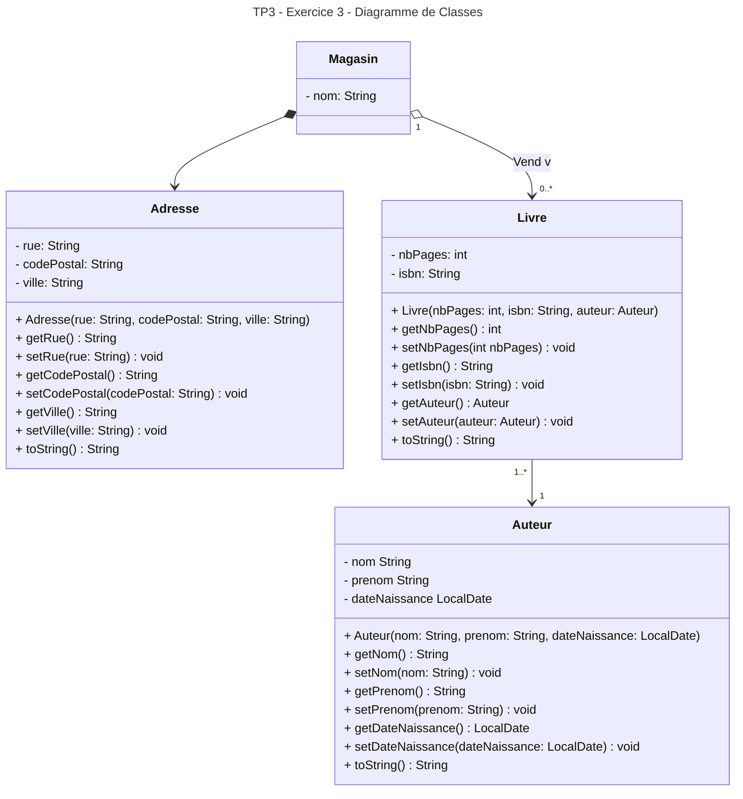

# TP3
## Exercice 3
### Diagramme de Classes

En faisant une **composition** de l'adresse dans le magasin, si deux magasins ont la même adresse, l'adresse sera dupliquée, mais nous pouvons considérer que notre client n'a aucune raison d'avoir deux magasins à la même adresse. 

De plus, si notre client décide de se séparer d'un magasin, il n'a aucune raison de garder son adresse. Grâce à la composition, si un magasin est supprimé, son adresse l'est aussi. Si on souhaite conserver l'adresse lorsqu'un magasin est fermé, une agrégation est préférable.